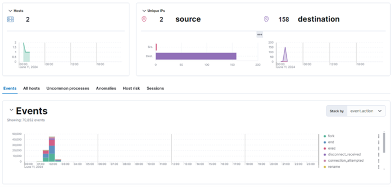
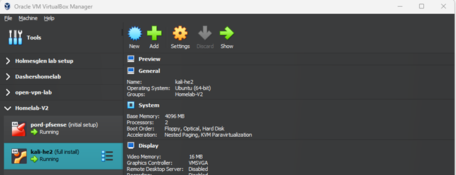
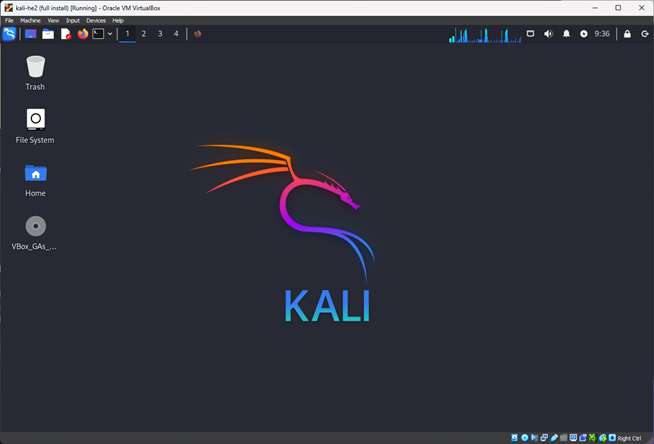
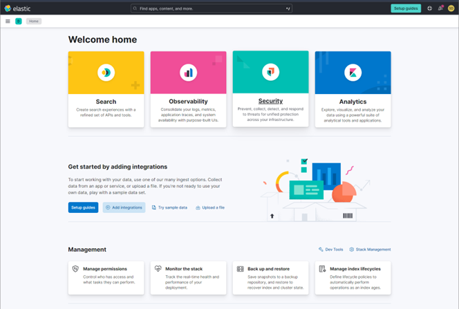
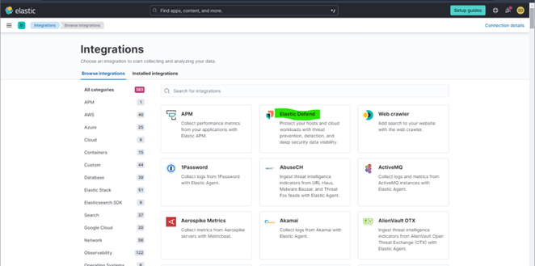
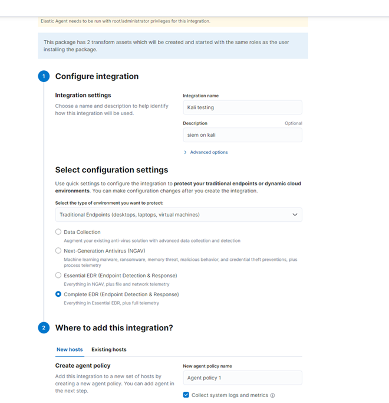
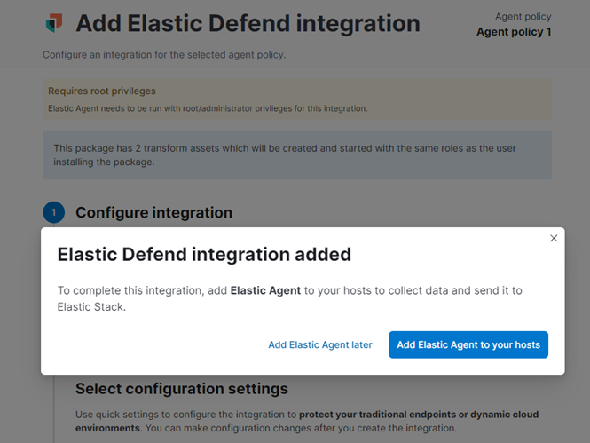
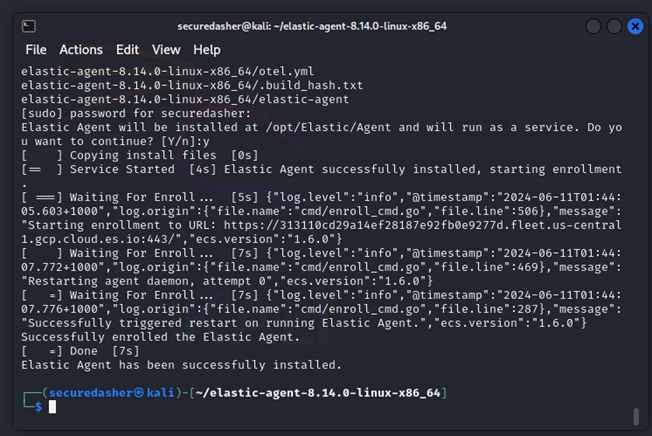
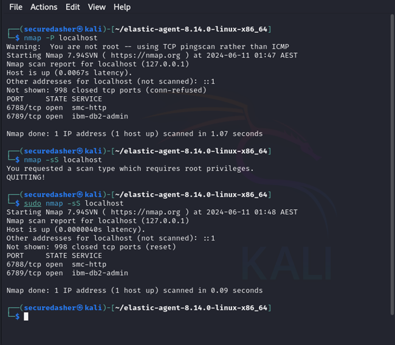
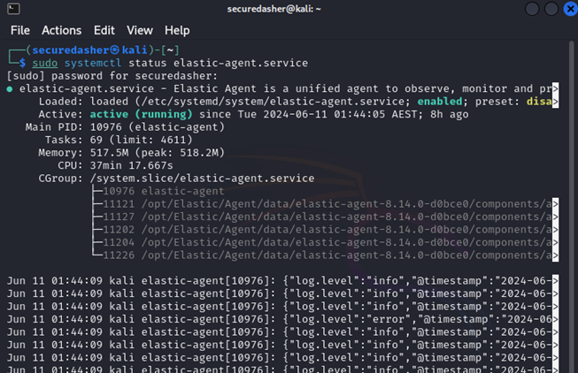

# Elastic-SIEM
<!--"" -->
<!--<h1>Elastic-SIEM </h1>-->

## Overview
Welcome to my home lab setup! "Dashershomelab" I've created this environment to learn and understand various aspects of networking, monitoring, prevention, administration, and hardening techniques. It's been an incredible learning experience, and I'm excited to share my setup with you.
This Lab is a simple Elastic SIEM lab to monitor security events and provide alerts. 

## Goal
- Setup and configure elastic stack SIEM.
- Configure Elastic agents for log collections.
- Configure Elastic agents for forwarding data to the SIEM
- Monitoring security events and threat detection.
- Create alert rules for detecting specific events.

 

## Prerequisites
- Virtual Box.
- Kali Linux VM.
- Elastic Account.
- Elastic agents and forwarders.

## Tasks

1.	### Setup VirtualBox.
2.	### Install Kali Linux VM in VirtualBox.
3.	### Setup an account with Elastic cloud.
4.	### Configure the Elastic Agent on Kali Linux VM to forward the logs to the SIEM.
5.	### Generate security events in Kali Linux.
6.	### Create a Dashboard to visualise the security events.
7.	### Create Rules/Alerts for security events.

## Task 1

### Install Kali Linux Vm on Virtual Box

- •	Download and install Virtual Box. https://www.virtualbox.org/wiki/Downloads

 

## Task 2

- •	Download and install Kali Linux Vm on VirtualBox. https://www.kali.org/get-kali/#kali-platforms
- •	Make sure you have internet access

 

## Task3

### Setup an account with Elastic cloud.
- •	Sign up for a free Elastic cloud account. It’s a 14-day trial.
- •	Create account and then log into it. Start you free trial by clicking on start your trial.
- •	Click on Create Deployment.
- •	You will enter the Homepage of Elastic cloud. Click on the hamburger menu to access integrations. 
- •	Once the configuration is completed. Click continue and you can find the deployment listed.

 
 

## Task 4

###Configuring the Elastic Agent

- •	On the Elastic SIEM Instance click on the Hamburger meu and scroll down.
- •	Click on the Add Integrations button.
- •	Select Elastic Defend.
- •	Select a name, description and pretty much use the default settings.
- •	Click on save and then click the button Install Elastic Agent Button
- •	Once done a message to add agent to Host pops up. Click on the Button.
- •	Follow the instructions and depending on the OS choose the add method, in this case I choose Linux, so I copy and paste the curl command in Kali terminal and execute it.
- •	Once installation completes we can test using ”sudo systemctl status elastc-agent.service”.

 
 
 
 
 
 
 
 
 

## Task5

### Generate security events in Kali.
- •	We can use nmap commands to generate security events.
- •	Using nmap -P localhost will scan kali itself.
- •	Once some events are generated we can go to the SIEM and view the logs.
- •	To view logs click on the hamburger menu, select observability and then click on logs.
